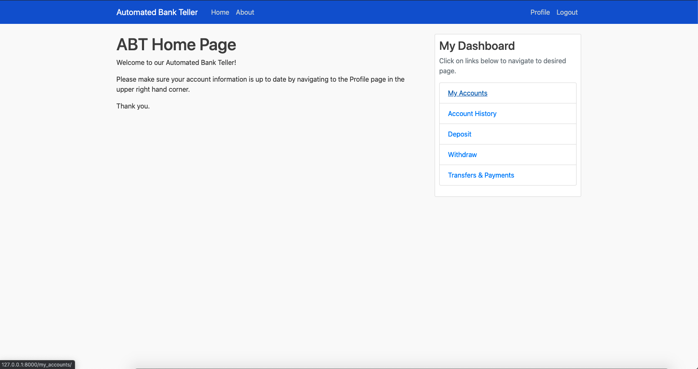
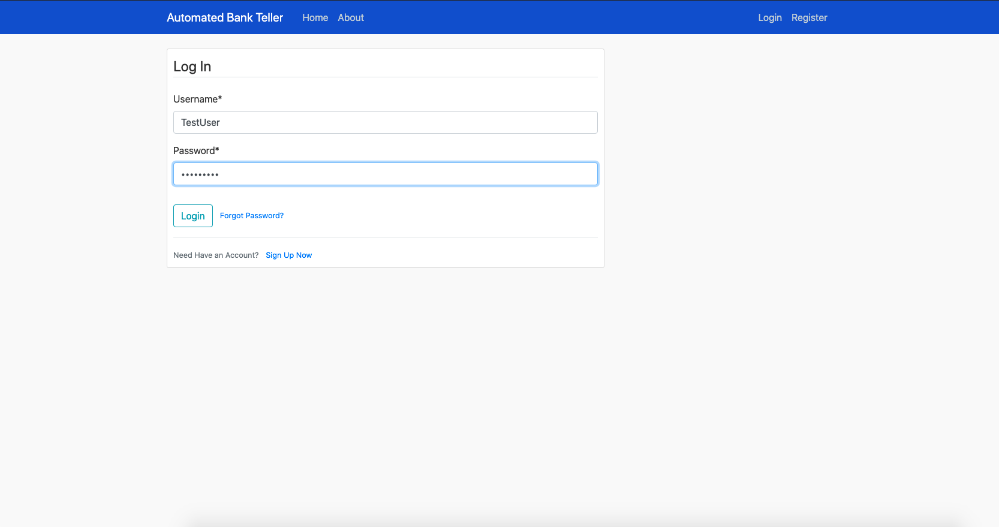
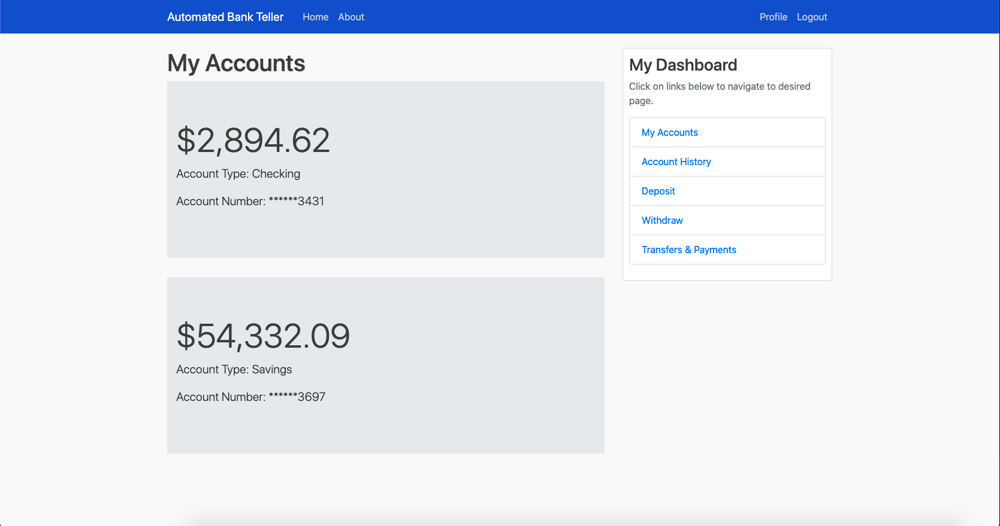
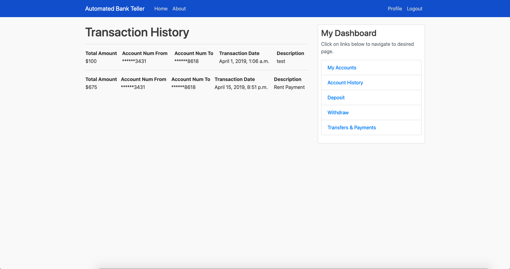
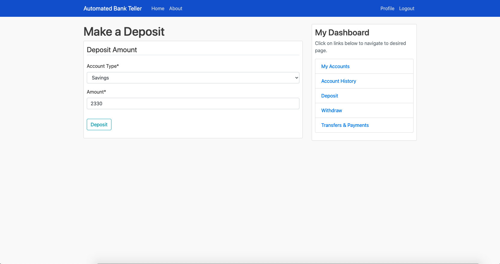
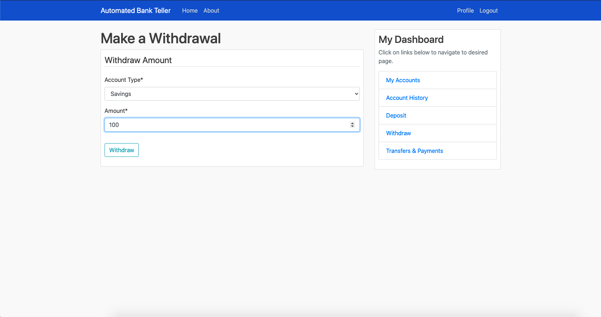
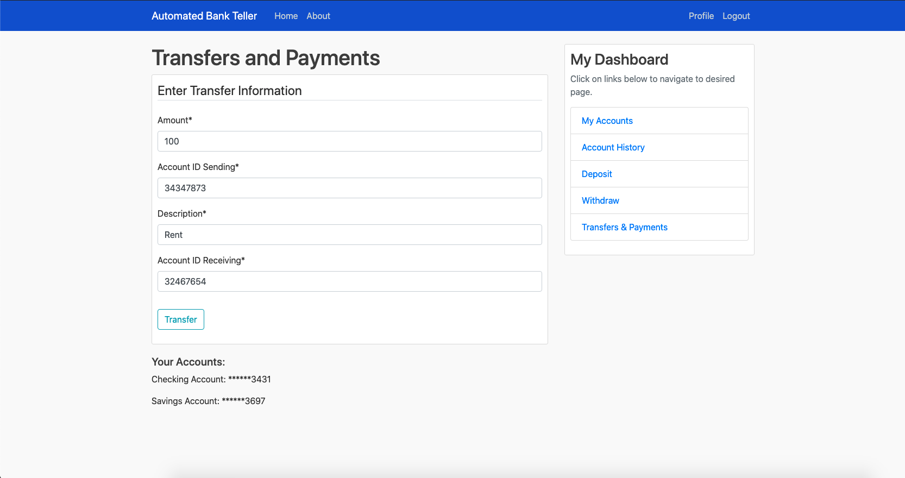

# Automated Bank Teller

This is an automated bank teller I made for a software engineering class. It includes user authentication and handles the different transactions a bank teller would do (transfers, deposits, withdrawals). Users can have either a checking and savings account which they can perform transactions on. This uses a SQLite database to keep track of users and what balances they have in different accounts and python backhand to handle the buisness logic.

This uses Django framework with Python backend, SQLite database, Bootstrap library and HTML.

Here are screenshots of the functionality:

References:
  * https://docs.djangoproject.com/en/2.1/
  * https://getbootstrap.com/docs/4.5/getting-started/introduction/
